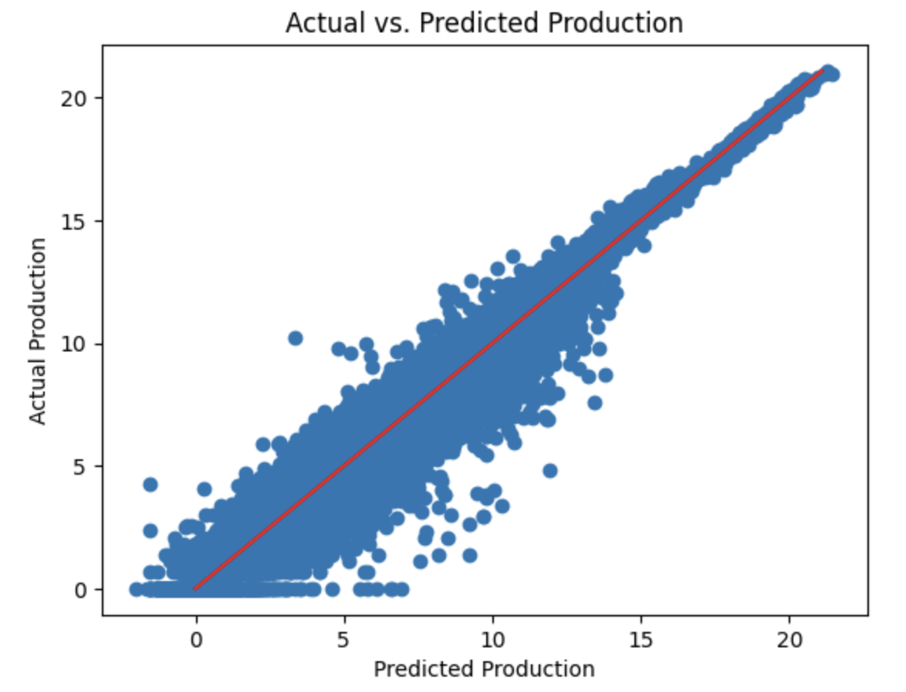
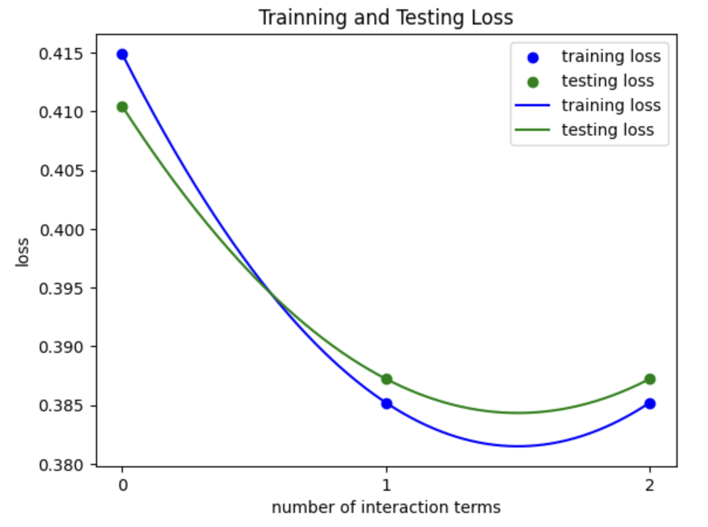

# CSE151A
## Overview
This is a project for CSE151A at UCSD. (The link to our <a href="https://github.com/xgui17/CSE151A/blob/main/Group%20Project%20Milestone%20%233.ipynb">jupyter notebook</a>)

This repository contains the analysis of crop yield data for India. The datasets used in the analysis include information on various crops grown in different states and districts of India and the corresponding yields of these crops in different years.

The dataset is obtained from <a href=https://www.kaggle.com/datasets/zsinghrahulk/india-crop-yield/data>kaggle</a>.

### Dataset Information
The dataset consists of the following columns:

  1. `State`: Indicates the State of India in which the crop yield is measured.
  2. `District`: Indicate the district of the State in which the crop is grown.
  3. `Crop`: Indicates the specific crop grown in the field. 
  4. `Crop_Year`: The year the crop was harvested or produced. 
  5. `Season`: Divides the cropping period of the crop into different seasons. 
  6. `Area`: Measurement of the area of a crop field. 
  7. `Production`: Indicates the total production of a crop field in a given season. 
  8. `Yield`: Calculates the yield per unit area for that particular observation.

## Insights

The dataset comprises 345,336 observations, covering 37 unique states, 707 districts, 55 different types of crops, 24 years, and 6 agricultural seasons.

The top states in the proportion of observations include Uttar Pradesh, Madhya Pradesh, Karnataka, Bihar, and Rajasthan.

Rice, maize, moong (green gram), urad, and sesamum are among the most cultivated crops.
The dataset exhibits variations in crop yield across different states, districts, crops, and seasons.

## Data Preprocessing
Preprocessing is a crucial step in preparing data for machine learning models. In our dataset, we applied several preprocessing techniques to enhance the quality and interpretability of the data.

### Handling of missing values: 

We dropped rows with missing values, considering they represent only 1.4% of the total data.

### Feature Transformation/Regularization:

Outliers in the `Area` and `Production` columns were retained, as they are considered representative of real-world agricultural practices.

We excluded the `Yield` column from our dataset since it directly corresponds to the ratio of `Area` to `Production`, which is already present. This eliminates redundancy and potential multicollinearity issues.

The `Production` and `Area` column underwent a log-transformation. Log-transformation helps make skewed data more symmetric and manageable for the model. It reduces the impact of outliers and ensures a more normal distribution, thereby improving the model's stability and performance.

### Handling Categorical Features:

Categorical features such as `Crop`, `Season`, `State` and `District` need to be converted into numerical values to be interpretable by machine learning models. We employed one-hot encoding to achieve this conversion. Notably, we undertook an aggregation of smaller `District` entities to reduce training and predictive burden. Districts representing less than 10% of the state's total were grouped into a collective category named "(state name)_other." This aggregation approach reduced the number of unique `District` categories from 707 to 80.

After one-hot encoding, the `Crop` feature expanded into 56 features, the `State` feature expanded into 37 features, the `Season` feature expanded into 6 features, and the `District` feature expanded into 80 features. This transformation ensures that categorical data are appropriately represented for analysis and modeling purposes.

By applying these preprocessing techniques, we have made the dataset more suitable for machine learning algorithms, enabling them to learn patterns and make accurate predictions or classifications effectively.

## Model 1: Polynomial Regression

### Introduction
This section presents an analytical approach to predicting crop productions using polynomial regression. Polynomial regression allows us to capture the nonlinear relationship between the independent and target variables, providing a more flexible modeling approach than simple linear regression.

### Polynomial Features
To capture the nonlinear relationships in the dataset, we introduce polynomial features. These features consist of a polynomial combination of the original features. We can better approximate the underlying data distribution by including a certain degree of polynomial features. 

### Model Training and Evaluation
We trained the polynomial regression model using the preprocessed dataset, including the polynomial features. The model was evaluated using Mean Squared Error (MSE) on both the training and test sets to assess its performance and generalization capability.

### Results
The performance metrics of the model are as follows:
- Mean squared error testing (MSE): about 0.3872
- Mean Squared Error Training (MSE): about 0.3852

These results show that the model performs consistently on the training and test sets, indicating it is not overfitting. More details can be seen in the <a href="https://github.com/xgui17/CSE151A/blob/main/Group%20Project%20Milestone%20%233.ipynb">jupyter notebook</a>.

  

  Figure 1: Actual vs. Predicted Production. It shows the alignment of our model's predictions with the actual `Production` values.

  

  Figure 2: the fitting graph. Our model with 2 interaction terms has improved performance compared to models with fewer interaction terms.

### Conclusion
The polynomial regression model is the first step in our analysis, allowing us to capture nonlinear relationships and gain insight into the factors that affect crop production. We will further refine and improve the model, such as feature selection, regularization, and exploring other regression models to improve prediction accuracy and deepen our understanding of crop production dynamics.

## Future models

In addition to the polynomial regression model discussed earlier, we are considering exploring two other models: dense layer neural networks and random forests.

### Neural networks with dense layers
Neural networks are powerful models that capture the complexity of nonlinear relationships in data. By using dense layers, neural networks can automatically learn the interactions between features, thus reducing the need for manual feature engineering. This makes them ideal for datasets like ours, where traditional linear models or simple polynomials may not adequately capture underlying patterns. Neural network modeling is flexible and has the potential to improve prediction accuracy.

### Random Forests
Random Forest is another model we plan to explore further. It is known for its robustness to overfitting and its ability to handle complex interactions between features. Random forests are particularly suitable for datasets with mixed feature types, as they can efficiently handle numeric and categorical variables. In addition, Random Forest can handle high dimensionality due to the single coding of categorical variables, which makes it an ideal candidate model for our dataset.
