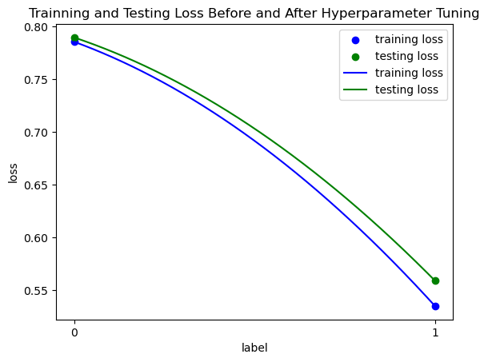
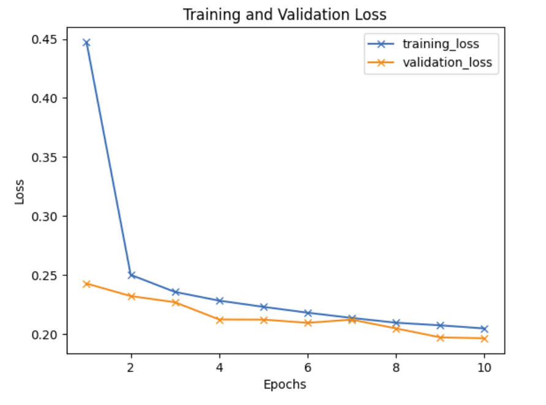

# CSE151A
## 1. Overview
This is a project for CSE151A at UCSD. (The link to our <a href="https://github.com/xgui17/CSE151A/blob/main/Model%203%20and%20Final%20Submission.ipynb">jupyter notebook</a>)

This repository contains the analysis of crop yield data for India. The datasets used in the analysis include information on various crops grown in different states and districts of India and the corresponding yields of these crops in different years.

The dataset is obtained from <a href=https://www.kaggle.com/datasets/zsinghrahulk/india-crop-yield/data>kaggle</a>.

### 1.1 Dataset Information
The dataset consists of the following columns:

  1. `State`: Indicates the State of India in which the crop yield is measured.
  2. `District`: Indicate the district of the State in which the crop is grown.
  3. `Crop`: Indicates the specific crop grown in the field. 
  4. `Crop_Year`: The year the crop was harvested or produced. 
  5. `Season`: Divides the cropping period of the crop into different seasons. 
  6. `Area`: Measurement of the area of a crop field. 
  7. `Production`: Indicates the total production of a crop field in a given season. 
  8. `Yield`: Calculates the yield per unit area for that particular observation.

## 2. Insights & Introduction(加intro/figure的部分)

The dataset comprises 345,336 observations, covering 37 unique states, 707 districts, 55 different types of crops, 24 years, and 6 agricultural seasons.

The top states in the proportion of observations include Uttar Pradesh, Madhya Pradesh, Karnataka, Bihar, and Rajasthan.

Rice, maize, moong (green gram), urad, and sesamum are among the most cultivated crops.
The dataset exhibits variations in crop yield across different states, districts, crops, and seasons.

## 3. Data Preprocessing
Preprocessing is a crucial step in preparing data for machine learning models. In our dataset, we applied several preprocessing techniques to enhance the quality and interpretability of the data.

### 3.1 Handling of missing values: 

We dropped rows with missing values, considering they represent only 1.4% of the total data.

### 3.2 Feature Transformation/Regularization:

Outliers in the `Area` and `Production` columns were retained, as they are considered representative of real-world agricultural practices.

We excluded the `Yield` column from our dataset since it directly corresponds to the ratio of `Area` to `Production`, which is already present. This eliminates redundancy and potential multicollinearity issues.

The `Production` and `Area` column underwent a log-transformation. Log-transformation helps make skewed data more symmetric and manageable for the model. It reduces the impact of outliers and ensures a more normal distribution, thereby improving the model's stability and performance.

### 3.3 Handling Categorical Features:

Categorical features such as `Crop`, `Season`, `State` and `District` need to be converted into numerical values to be interpretable by machine learning models. We employed one-hot encoding to achieve this conversion. Notably, we undertook an aggregation of smaller `District` entities to reduce training and predictive burden. Districts representing less than 10% of the state's total were grouped into a collective category named "(state name)_other." This aggregation approach reduced the number of unique `District` categories from 707 to 80.

After one-hot encoding, the `Crop` feature expanded into 56 features, the `State` feature expanded into 37 features, the `Season` feature expanded into 6 features, and the `District` feature expanded into 80 features. This transformation ensures that categorical data are appropriately represented for analysis and modeling purposes.

By applying these preprocessing techniques, we have made the dataset more suitable for machine learning algorithms, enabling them to learn patterns and make accurate predictions or classifications effectively.

## 4. Model 1: Polynomial Regression

### 4.1 Introduction
This section presents an analytical approach to predicting crop productions using polynomial regression. Polynomial regression allows us to capture the nonlinear relationship between the independent and target variables, providing a more flexible modeling approach than simple linear regression.

### 4.2 Polynomial Features
To capture the nonlinear relationships in the dataset, we introduce polynomial features. These features consist of a polynomial combination of the original features. We can better approximate the underlying data distribution by including a certain degree of polynomial features. 

### 4.3 Model Training and Evaluation
We trained the polynomial regression model using the preprocessed dataset, including the polynomial features. The model was evaluated using Mean Squared Error (MSE) on both the training and test sets to assess its performance and generalization capability.

### 4.4 Polynomial Regression Results
The performance metrics of the model are as follows:
- Mean squared error testing (MSE): about 0.3872
- Mean Squared Error Training (MSE): about 0.3852

These results show that the model performs consistently on the training and test sets, indicating it is not overfitting. More details can be seen in the <a href="https://github.com/xgui17/CSE151A/blob/main/Group%20Project%20Milestone%20%233.ipynb">jupyter notebook</a>.

  

  Figure 1: Actual vs. Predicted Production. It shows the alignment of our model's predictions with the actual `Production` values.

  

  Figure 2: the fitting graph. Our model with 2 interaction terms has improved performance compared to models with fewer interaction terms.

### 4.5 Conclusion for model 1
The polynomial regression model is the first step in our analysis, allowing us to capture nonlinear relationships and gain insight into the factors that affect crop production. We will further refine and improve the model, such as feature selection, regularization, and exploring other regression models to improve prediction accuracy and deepen our understanding of crop production dynamics.

### 4.6 Future models

In addition to the polynomial regression model discussed earlier, we are considering exploring two other models: dense layer neural networks and random forests.

#### Neural networks with dense layers
Neural networks are powerful models that capture the complexity of nonlinear relationships in data. By using dense layers, neural networks can automatically learn the interactions between features, thus reducing the need for manual feature engineering. This makes them ideal for datasets like ours, where traditional linear models or simple polynomials may not adequately capture underlying patterns. Neural network modeling is flexible and has the potential to improve prediction accuracy.

#### Random Forests
Random Forest is another model we plan to explore further. It is known for its robustness to overfitting and its ability to handle complex interactions between features. Random forests are particularly suitable for datasets with mixed feature types, as they can efficiently handle numeric and categorical variables. In addition, Random Forest can handle high dimensionality due to the single coding of categorical variables, which makes it an ideal candidate model for our dataset.

### 4.7 Evaluation of Data, Labels, and Loss Function

The similarity in performance metrics suggests that the data and labels were sufficiently represented by the training and test datasets. The consistent performance also implies that the data was properly cleaned and preprocessed, including the effective use of one-hot encoding for categorical variables, ensuring that no significant bias or noise was introduced. The choice of Mean Squared Error (MSE) as the loss function appears to have been appropriate for this regression task, as evidenced by the model's ability to generalize well from the training data to unseen data.

## 5. Model 2: Random Forest Regression

### 5.1 Introduction
In this section, we explore the application of Random Forest Regression as a modeling technique for crop production forecasting. Random forest regression is a powerful ensemble learning method capable of capturing complex relationships in data by combining multiple decision trees.

### 5.2 Model Training and Evaluation
We trained the random forest regression model using the first model's processed data and features. The dataset was split into training and test sets to facilitate model evaluation. The model is then fitted to the training data and used to make predictions on the test set.

### 5.3 Random Forest Results
The performance metrics of the model are as follows:
- Mean squared error Testing (MSE): about 0.7894
- Mean Squared Error Training (MSE): about 0.7853

This indicates that the test set has a slightly higher error than the training set, suggesting slight overfitting.

### 5.4 Hyperparameter Tuning
To optimize the performance of the model, we tuned the hyperparameters with 5-fold cross-validation using GridSearchCV. This involved exploring different combinations of hyperparameters, such as the number of estimators and the maximum depth of the tree, to determine the optimal configuration.

### 5.5 Hyperparameter Tuner Results
- Best Parameters: 'max_depth': 15, 'n_estimators': 200
- Best Model Mean Squared Error: 0.5588088610648668

  

  Figure 3: the fitting graph of Model 2. Our model after Hyperparameter Tuning has improved performance.

### 5.6 Conclusion for model 2
The random forest regression model initially exhibited a degree of overfitting, which was reflected in the higher MSE on the test set than on the training set. However, by tuning the hyperparameters, we significantly improved the performance of the model, thereby reducing the MSE on both the training and test sets.

The random forest regression model showed better performance after hyperparameter tuning than the polynomial regression model. Despite encountering runtime issues due to the model's computational complexity, we optimized the model's performance through effective hyperparameter tuning techniques.

To further enhance the random forest regression model, we can explore the dimensionality reduction technique and try to use the ensemble approach to improve the prediction accuracy while solving the runtime limitation problem. In conclusion, the random forest regression model shows better prediction of crop yields. 

### 5.7 Next Model Plan
We plan to use Neural Networks as our next model. Neural networks are good at modeling complex, non-linear relationships between features, which might not be effectively captured by polynomial regression or even random forests, as used in our first two models. Production can be influenced by intricate interactions between various factors, such as area, season, and so on. A neural network's ability to capture these non-linearities could lead to better predictive performance. Additionally, after one-hot encoding of categorical variables, our datasets become high-dimensional. Neural networks are adept at handling high-dimensional data and automatically learning feature representations that are most relevant for prediction, potentially leading to more accurate predictions.

## 6. Model 3: Neural Net

### 6.1 Introduction
In this section, we employ a neural network with dense layers to predict crop production. By analyzing patterns in crop data, we aim to develop a model that can forecast production with high accuracy. Initial models were simplistic, setting the stage for more advanced neural networks and hyperparameter tuning to refine predictions.

### 6.2 Model Training and Evaluation
The model training involved preparing the dataset, defining the architecture with dense layers, and selecting activation functions and optimizers. The use of Keras Tuner facilitated the fine-tuning of hyperparameters. We employed techniques like k-fold cross-validation to ensure that the model's performance was robust across different subsets of data.

### 6.3 Baseline Neural Network
We established a baseline performance for our dataset using a simple neural network model, with parameters selected randomly. We used: three dense layers each featuring 16 neurons utilizing sigmoid activation, and a final output layer tailored for regression. It was compiled with the SGD optimizer, set at a learning rate of 0.1, and trained over 10 epochs with a batch size of 10.

The training process concluded with the baseline model achieving a training MSE of 0.30139625 and a testing MSE of 0.31464802. The close proximity of training and testing errors suggests a well-generalizing model from the outset, underscoring the potential of neural networks in our dataset's context.

### 6.4 Hyperparameter Tuner Results
The trained neural network, optimized through random search and early stopping, demonstrated a high level of accuracy. The hyperparameter tuning concluded with an optimal set of parameters, including:
- Learning rate: 0.001
- Number of nodes per layer: 32
- Activation Function: ReLU activation function
- Optimizer: Adam optimizer

And we got the result:
- Mean squared error Testing (MSE): about 0.202
- Mean Squared Error Training (MSE): about 0.193

  

  Figure 4: the fitting graph of Model 3. The performance of our model has improved as number of epochs increases.

### 6.5 Conclusion for model 3
The model significantly improved the predictive accuracy for crop production compared to initial versions. The success of the model was further confirmed through k-fold cross-validation, ensuring consistent performance across various data segments and bolstering confidence in the model's generalizability. This suggests not only a high level of accuracy but also an ability to adapt to new, unseen data, thereby avoiding common issues such as overfitting and underfitting. 

Future improvements for enhancing model performance include data augmentation, advanced feature engineering, and exploring ensemble methods or more sophisticated neural network architectures. Additionally, integrating external datasets could further improve predictions, making the model an even more powerful tool for agricultural planning and forecasting. These steps will aim to solidify the model's applicability in real-world scenarios, ensuring it can serve as a reliable decision-support tool in agricultural production systems.

## 7. Methods
### 7.1 Data Exploration
- **Observation Count (`shape[0]`)**: Identifies the total number of observations in the dataset.
- **Column Examination (manual categorization)**: Columns classified into categorical and numerical groups.
- **Missing Data Analysis (`isna().sum()/shape[0]`)**: Detects missing values in the dataset.
- **Data Distribution (`describe()`)**: Understands the distribution of numerical variables.
- **Uniqueness Analysis (`nunique()`)**: Checks the number of unique values in each column.
- **Value Counts for Categorical Data (`value_counts(normalize=True)[:5]`)**: Provides a deeper understanding of categorical variables.
- **Outlier Identification**: Identifies outliers in each column.

### 7.2 Preprocessing
- **Addressing Missing Values**: Eliminates rows containing missing values.
- **Addressing Outliers**: Recognizes the potential influence of outliers, especially in the `Area` and `Production` columns.
- **Drop Unused Column**: `Yield` column excluded to mitigate multicollinearity risks and enhance interpretability.
- **Log Transformation**: Addresses skewness in the data, improving predictive model performance.
- **One-hot Encode**: Helps in better learning from categorical columns.
- **Aggregation**: Simplifies specific columns to prepare the dataset for deeper analysis.

### 7.3 Model 1 - Polynomial Regression
- **Polynomial Regression**: Captures complex, nonlinear dynamics in agricultural productions.
- **Baseline Linear Regression**: Establishes a baseline for comparison with more complex models.
- **Feature Extension**: Introduces higher-degree combinations of existing variables to reflect the complexity of agricultural production.
- **MSE Metric**: Facilitates a comprehensive assessment of model accuracy and generalizability.
- **Comparative Analysis**: Between baseline linear regression and polynomial regression with an interactive term to evaluate polynomial model's efficacy.

### 7.4 Model 2 - Random Forest Regressor
- **Random Forest Regressor**: Utilizes ensemble learning with multiple decision trees for accurate and robust predictions.
- **Baseline Model**: Training and testing split to evaluate the predictive capabilities and generalizability of the model.
- **Hyperparameter Tuner**: Systematic search over a parameter grid to minimize prediction error.
- **MSE Metric**: Used to capture the predictive accuracy of the model.

### 7.5 Model 3 - Neural Network with Dense Layers
- **Neural Network**: Models complex patterns using a sophisticated approach for better predictions.
- **Baseline**: Utilizes three dense layers with sigmoid activation and a final output layer for regression, trained with SGD optimizer.
- **Hyperparameter Tuner**: Employs Keras Tuner to find the optimal model configuration.
- **K-fold Cross-Validation**: Evaluates model performance across different dataset segments for a comprehensive view.
- **MSE Metric**: Aligns with previous models to measure predictive accuracy.

## 8. Results
### 8.1 Data Exploration
- **Observation Count (`shape[0]`)**: The dataset comprises 345,336 observations.
- **Column Examination**: Five categorical columns (`State`, `District`, `Crop`, `Crop_Year`, `Season`) and three numerical columns (`Area`, `Production`, `Yield`).
- **Missing Data Analysis**: Detected missing values, leading to considerations about retention or removal.
- **Data Distribution**: Analysis allows identification of variable spread and central tendencies.
- **Uniqueness Analysis**: Identified 37 unique states, 707 districts, 55 crops, 24 crop years, and 6 seasons.
- **Value Counts for Categorical Data**: Top five values in each categorical column analyzed, with Uttar Pradesh as the most frequent state, highlighting its agricultural significance.
- **Outlier Identification**: Outliers in `Area` and `Production` were deemed reasonable within the agricultural context and retained.

### 8.2 Preprocessing
- **Addressing Missing Values**: Rows with missing values were removed, affecting only 1.4% of the dataset.
- **Addressing Outliers**: Outliers in `Area` and `Production` columns were retained, considered true representations of agricultural data variability.
- **Drop Unused Column**: The `Yield` column was dropped, being redundant as its values can be derived from `Area` and `Production`.
- **Log Transformation**: Applied to normalize distributions and improve predictive model performance.
- **One-hot Encode**: Converted categorical columns into numerical formats for effective learning.
- **Aggregation**: Simplified the `District` category by aggregating less represented districts into an `Other` category for each state.

### 8.3 Model 1 - Polynomial Regression
- **Polynomial Regression**: Captured nonlinear relationships to illuminate factors affecting crop production.
- **Feature Extension**: Creation of interactive polynomial features, such as `Season`*`Crop` and `Crop_year`*`Season`, enhanced model sophistication.
- **MSE Metric**: Test MSE of 0.3872 and Train MSE of 0.3852.
- **Comparative Analysis**: Balanced approach to avoid underfitting or overfitting.

### 8.4 Model 2 - Random Forest Regressor
- **Random Forest Regressor**: Trained on processed data and features, with the model evaluated on split training and test sets.
- **Baseline Model**: Achieved Test MSE of 0.7894 and Train MSE of 0.7853.
- **Hyperparameter Tuner**: Best parameters found were max_depth of 15 and n_estimators of 200.
- **MSE Metric**: Best model MSE of 0.5588.

### 8.5 Model 3 - Neural Network with Dense Layers
- **Neural Network**: Prepared dataset and defined architecture with dense layers, activation functions, and optimizers.
- **Baseline**: Achieved Train MSE of 0.3014 and Test MSE of 0.3146.
- **Hyperparameter Tuner**: Optimal parameters included a learning rate of 0.001, 32 nodes per layer, ReLU activation function, and Adam optimizer.
- **K-fold Cross-Validation**: Ensured model robustness and no overfitting.
- **MSE Metric**: Test MSE of 0.202 and Train MSE of 0.193.

  

  Figure 5: MSE by Model Type

## Discussion

## Conclusion

## Collaboration section
