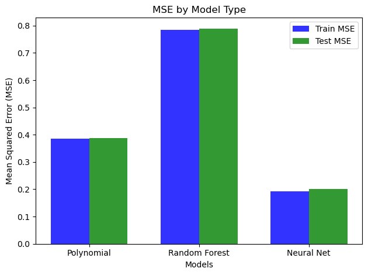

## Overview
This is the project repository for CSE151A at UCSD in WI24. It encompasses a comprehensive analysis and the development of predictive models focused on crop yield data in India. Inside, you will find datasets, analytical scripts, model training algorithms, and results that aim to enhance our understanding and forecasting of agricultural productivity. Detailed documentation is provided to guide you through each component of the project.

Below is the writeup for this project. Here is the link to our <a href="https://github.com/xgui17/CSE151A/blob/main/Model%203%20and%20Final%20Submission.ipynb">jupyter notebook</a>, feel free to check it out!

## 1. Introduction
India stands as the world's largest country by population and seventh largest country by area, a factor that inherently underscores the critical need for sustainable agricultural practices to ensure food security for its billions of inhabitants. The sustainability of people’s daily food source is not just a matter of national concern but has global implications, considering India's significant role in the global food market. As a major producer of various staple crops, including rice, wheat, pulses, any fluctuation in India's agricultural output can have far-reaching effects on global food prices and availability. This project is aimed at predicting crop production in India, hoping to leverage machine learning techniques to tackle the challenge of optimizing agricultural output. By analyzing various features such as season, geographical data, and crop variety, the project seeks to explore and forecast crop production. This predictive goal offers the potential to improve how agricultural policy is formulated and how resources are allocated. This project is interesting due to its unique and interdisciplinary structure, which merges the realms of agriculture, environmental science, and technology. It embodies the essence of innovation, applying the latest advancements in data analytics and machine learning to solve real-world problems that could potentially affect millions of lives. Moreover, by predicting crop production, the project provides insights that can help in mitigating the effects of potential food shortages, reducing waste, and enhancing food distribution strategies.By understanding the variables that impact crop production, the project can guide farmers towards more sustainable agricultural practices, reducing the environmental footprint of farming and ensuring the long-term viability of India's agricultural sector.

The dataset stands out for its completeness. This characteristic is vital as it ensures that the dataset provides a comprehensive overview of the variables influencing crop production in India. A well-constructed description accompanying the dataset offers clear insights into what the data represents. Credibility is another cornerstone of the dataset's selection. The source of the original data is transparently indicated, assuring of its authenticity and reliability. By relying on a dataset whose origins are clear and verifiable, the project establishes a solid foundation that readers can trust. Compatibility is equally critical. The dataset is structured in such a way that there are no ambiguous columns or undefined values, such that each piece of data can be accurately interpreted and utilized in predictive models. The cleanliness and usability of the dataset is also another key component. With minimal null values and a well-maintained structure, the dataset is primed for analysis without the need for extensive cleaning or preprocessing. In summary, the dataset for predicting crop production in India was chosen due to its completeness, credibility, compatibility, and cleanliness. These attributes ensure that the dataset is not only easy to work with but also robust and reliable, providing a strong foundation for generating accurate and meaningful predictions. 

## 2. Figures

## 3. Methods

### 3.1 Data Exploration
The dataset used in the analysis include information on various crops grown in different states and districts of India and the corresponding yields of these crops in different years. The dataset is obtained from <a href=https://www.kaggle.com/datasets/zsinghrahulk/india-crop-yield/data>kaggle</a>. For ease of access, it is replicated within this repository.

The dataset consists of the following columns:

  1. `State`: Indicates the State of India in which the crop yield is measured.
  2. `District`: Indicate the district of the State in which the crop is grown.
  3. `Crop`: Indicates the specific crop grown in the field. 
  4. `Crop_Year`: The year the crop was harvested or produced. 
  5. `Season`: Divides the cropping period of the crop into different seasons. 
  6. `Area`: Measurement of the area of a crop field. 
  7. `Production`: Indicates the total production of a crop field in a given season. 
  8. `Yield`: Calculates the yield per unit area for that particular observation.

The data exploration consists of several parts:

  - **Observation Count (`shape[0]`)**: Identifies the total number of observations in the dataset.
  - **Column Examination (manual categorization)**: Columns classified into categorical and numerical groups.
  - **Missing Data Analysis (`isna().sum()/shape[0]`)**: Detects missing values in the dataset.
  - **Data Distribution (`describe()`)**: Understands the distribution of numerical variables.
  - **Uniqueness Analysis (`nunique()`)**: Checks the number of unique values in each column.
  - **Value Counts for Categorical Data (`value_counts(normalize=True)[:5]`)**: Provides a deeper understanding of categorical variables.
  - **Outlier Identification**: Identifies outliers in each column.

### 3.2 Preprocessing
- **Addressing Missing Values**: Eliminates rows containing missing values.
- **Addressing Outliers**: Recognizes the potential influence of outliers, especially in the `Area` and `Production` columns.
- **Drop Unused Column**: `Yield` column excluded to mitigate multicollinearity risks and enhance interpretability.
- **Log Transformation**: Addresses skewness in the data, improving predictive model performance.
- **One-hot Encoding**: Helps in better learning from categorical columns.
- **Aggregation of Low-frequency Categorical Values**: Simplifies specific columns to prepare the dataset for deeper analysis.

### 3.3 Model 1 - Polynomial Regression
**Polynomial Regression**: Captures complex, nonlinear dynamics in agricultural productions.

- **Train Test Split**: Split the dataset into training and testing sets to evaluate the predictive capabilities and ensure generalizability.
- **Baseline Model**: Uses a baseline linear regression to establish a baseline for comparison with more complex models.
- **Feature Extension**: Introduces higher-degree combinations of existing variables to reflect the complexity of agricultural production.
- **MSE Metric**: Facilitates a comprehensive assessment of model accuracy and generalizability.
- **Comparative Analysis**: Between baseline linear regression and polynomial regression with an interactive term to evaluate polynomial model's efficacy.

### 3.4 Model 2 - Random Forest Regressor
**Random Forest Regressor**: Utilizes ensemble learning with multiple decision trees for accurate and robust predictions.

- **Train Test Split**: Split the dataset into training and testing sets to evaluate the predictive capabilities and ensure generalizability.
- **Baseline Model**: Uses a baseline regressor with randomly selected parameters as a reference.
- **Hyperparameter Tuner**: Systematic search over a parameter grid to minimize prediction error.
- **MSE Metric**: Used to capture the predictive accuracy of the model.

### 3.5 Model 3 - Neural Network with Dense Layers
**Neural Network**: Models complex patterns using a sophisticated approach for better predictions.

- **Train Test Split**: Split the dataset into training and testing sets to evaluate the predictive capabilities and ensure generalizability.
- **Baseline Model**: Utilizes three dense layers with sigmoid activation and a final output layer for regression, trained with SGD optimizer to establish a baseline performance for future comparison.
- **Hyperparameter Tuner**: Employs Keras Tuner to find the optimal model configuration.
- **K-fold Cross-Validation**: Evaluates model performance across different dataset segments for a comprehensive view.
- **MSE Metric**: Aligns with previous models to measure predictive accuracy.

## 4. Results

### 4.1 Data Exploration
- **Observation Count (`shape[0]`)**: The dataset comprises 345,336 observations.
- **Column Examination**: Five categorical columns (`State`, `District`, `Crop`, `Crop_Year`, `Season`) and three numerical columns (`Area`, `Production`, `Yield`).
- **Missing Data Analysis**: Detected missing values, leading to considerations about retention or removal.
- **Data Distribution**: Analysis allows identification of variable spread and central tendencies.
- **Uniqueness Analysis**: Identified 37 unique states, 707 districts, 55 crops, 24 crop years, and 6 seasons.
- **Value Counts for Categorical Data**: Top five values in each categorical column analyzed, with Uttar Pradesh as the most frequent state, highlighting its agricultural significance.
- **Outlier Identification**: Outliers in `Area` and `Production` were deemed reasonable within the agricultural context and retained.

### 4.2 Preprocessing
- **Addressing Missing Values**: Rows with missing values were removed, affecting only 1.4% of the dataset.
- **Addressing Outliers**: Outliers in `Area` and `Production` columns were retained, considered true representations of agricultural data variability.
- **Drop Unused Column**: The `Yield` column was dropped, being redundant as its values can be derived from `Area` and `Production`.
- **Log Transformation**: Applied to normalize distributions and improve predictive model performance.
- **One-hot Encode**: Converted categorical columns into numerical formats for effective learning.
- **Aggregation**: Simplified the `District` category by aggregating less represented districts into an `Other` category for each state.

### 4.3 Model 1 - Polynomial Regression
**Polynomial Regression**: Captured nonlinear relationships to illuminate factors affecting crop production.

- **Baseline Model**: Constructed a baseline model with Train MSE of 0.4170 and Test MSE of 0.4126.
- **Feature Extension**: Creation of interactive polynomial features, such as `Season`*`Crop` and `Crop_year`*`Season`, enhanced model sophistication.
- **MSE Metric**: Train MSE of 0.3852 and Test MSE of 0.3872.
- **Comparative Analysis**: Made sure that our model is neither underfitting or overfitting.

### 4.4 Model 2 - Random Forest Regressor
**Random Forest Regressor**: Trained on processed data and features, with the model evaluated on split training and test sets.

- **Baseline Model**: Constructed a baseline model with Train MSE of 0.7853 and Test MSE of 0.7894.
- **Hyperparameter Tuner**: Best parameters found were max_depth of 15 and n_estimators of 200.
- **MSE Metric**: Best model MSE of 0.5588.

### 4.5 Model 3 - Neural Network with Dense Layers
**Neural Network**: Prepared dataset and defined architecture with dense layers, activation functions, and optimizers.

- **Baseline**: Achieved Train MSE of 0.3014 and Test MSE of 0.3146.
- **Hyperparameter Tuner**: Optimal parameters included a learning rate of 0.001, 32 nodes per layer, ReLU activation function, and Adam optimizer.
- **K-fold Cross-Validation**: Ensured model robustness and no overfitting.
- **MSE Metric**: Train MSE of 0.193 and Test MSE of 0.202.

### 4.6 Compare Model Performances

Based on the results, our third model, Neural Network with Dense Layers, demonstrates the best performance in terms of MSE.

  

  Figure 5: MSE by Model Type

## 5. Discussion
In the Exploratory Data Analysis (EDA), we first examined the number of observations totaling 345,336 observations, providing a large dataset for our analysis. This large sample size enhances the robustness of our modeling efforts and increases our confidence in the generalizability of our findings. In the data preprocessing phase of our study, we took several steps to refine the dataset for subsequent modeling. Initially, we addressed missing values by eliminating rows that contained them, which constituted a mere 1.4% of our dataset, thereby preserving the integrity of our data without significant loss. Recognizing the potential influence of outliers, especially in the "Area" and "Production" columns, we opted to retain these values, considering them as true representations of the variability inherent in agricultural data. To mitigate the risks of multicollinearity and enhance data interpretability, the "Yield" column was excluded from the analysis; we consider its information to be redundant since it could be calculated from the "Area" and "Production" values. Further, we applied log transformation to both the "Production" and "Area" columns to address the skewness of the data, aiming to normalize the distribution and improve the performance of the predictive models. Categorical features, such as "Crop", "Season", "State", and "District," were transformed into numerical values using one-hot encoding, a critical step for enabling machine learning algorithms to process and learn from these variables effectively. 

In Model 1, our approach of polynomial regression aims to capture the complex nonlinear relationship between Production and other variables. By incorporating interactive polynomial features, we attempt to enhance the complexity of the model and improve its accuracy. However, the decision to exclude the "region" column from this model may have overlooked potentially valuable geographic insights that could affect the prediction.

Compared to the polynomial regression model, our model 2, the random forest regression model, has improved performance despite being computationally intensive. However, runtime issues encountered during training, evaluation, and hyper-parameter tuning stages highlight a significant shortcoming of this approach. To reduce the computational complexity while maintaining predictive accuracy, we may try dimensionality reduction techniques in the future.

Our final model, the Dense Layer Neural Network model, also utilizes hyper-parameter tuning and validation strategies, which achieve the highest prediction accuracy. The model has demonstrated a better ability to capture complex relationships between features and target variables suggests. However, there is still room for improvement of the model through techniques such as advanced feature engineering, ensemble methods, or external dataset integration.

## 6. Conclusion
Through EDA, data preprocessing, and model development, we gained valuable insights into the relationship between production and other factors in agriculture. As we concluded this phase of the project, a number of potential avenues for reflection and future exploration emerged.

One important aspect we recognized was the importance of feature selection and engineering design. While our model effectively utilized existing variables, there may be untapped potential for exploring additional features or deriving new features to improve prediction accuracy. For example, integrating external datasets such as weather patterns, soil types, and economic indicators could provide valuable background information and improve model robustness.

In addition, our exploratory data analysis reveals variability in agricultural production practices across regions and seasons. While we provide localized and temporal analyses, in-depth studies of region-specific factors and seasonal variations can provide richer insights into crop production dynamics. This may require subgroup analyses.

While we have utilized polynomial regression, random forest regression, and neural networks with dense layers, there are a number of possible directions for model improvement in the future.

Decision trees are a potential alternative to our current model. Decision trees provide a transparent, interpretable method for modeling complex relationships in data. Decision trees can effectively capture nonlinearities and interactions between variables by recursively partitioning the feature space according to specific criteria. In addition, ensemble methods such as Gradient Boosting Machine (GBM) or Extreme Gradient Boosting (XGBoost) can further enhance the predictive power of decision trees by combining multiple weak learners into one strong predictor.

In addition, ensemble methods like Stacking can utilize the diversity of multiple base learners to complement our existing models. Stacking methods use meta-learners to combine predictions from multiple models to generate final predictions, thus potentially improving prediction accuracy and generalization performance.

Furthermore, models can be refined through more advanced hyperparameter tuning techniques. While we have utilized methods such as GridSearchCV and Keras Tuner to optimize model parameters, more sophisticated methods, such as Bayesian optimization, may lead to further improvements.

In conclusion, while our current model has achieved reasonably good accuracy, many ways exist to explore and improve it further. Considering alternative models and exploring other advanced hyperparameter tuning techniques may allow us to refine our prediction models and provide new insights into crop production prediction.

## 7. Collaboration

